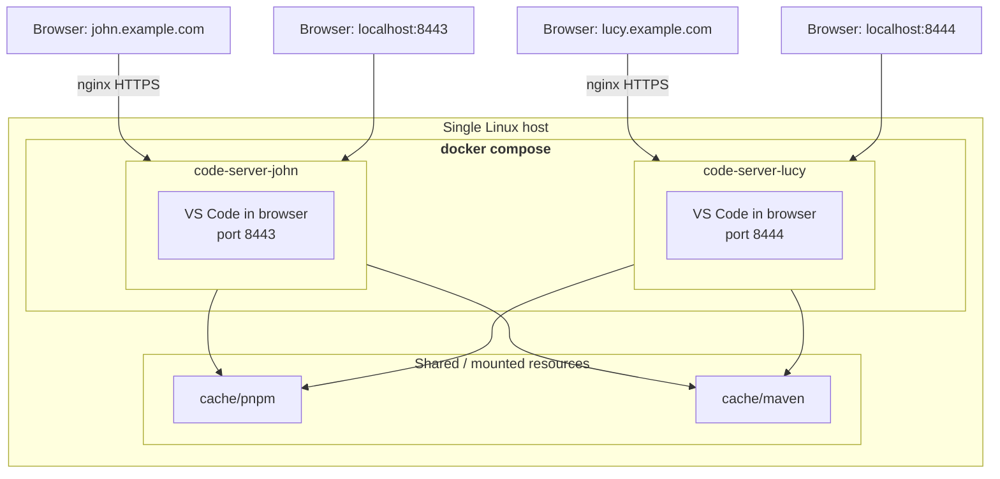

# Multiple-User VS Code WebIDE - Code Server with Docker

**[English](README.md) | [中文](README.zh-CN.md)**

Run multiple, fully isolated, browser-based VS Code instances — **one `code-server` container per developer** — on a single host using Docker Compose. Each user gets their own settings, extensions and files, while sharing the same machine, image and dependency caches.

## Why this project?

Instead of running one big VS Code server that everyone shares, this setup gives every developer an **independent container**. One person installing extensions, tweaking settings or even crashing their instance never affects the others — yet they still benefit from shared disk caches, so common dependencies are downloaded only once.

## Features

- **Isolated per-user instances** — one container per user (`code-server-john`, `code-server-lucy`, …) with independent settings, extensions and workspaces.
- **Preconfigured development image** — built on the community-maintained [`linuxserver/code-server`](https://github.com/linuxserver/docker-code-server) image, adding:
  - Node.js 24 & pnpm
  - OpenJDK 21 & Maven
  - vim, curl, etc.
- **Automatic per-user Git setup** — on first start, Git user name/email and defaults (`pull.rebase`, `init.defaultBranch`) are initialized from per-user environment variables.
- **Per-user data persistence** — each user's `/config` (settings, extensions, workspaces, `.gitconfig`) lives in its own host directory.
- **Optional SSH key mount** — a read-only host private key can be mounted into each container for git/ssh operations.
- **Shared dependency caches** — a common pnpm store and Maven repository are mounted into every container to save disk space and bandwidth.
- **Pre-seeded extensions** — offline-ready extensions (e.g. GitLens, DeepSeek V4 for Copilot) are kept under `config/extensions` and mirrored into each user's profile.
- **HTTPS reverse proxy examples** — ready-made nginx server blocks exposing each instance on its own subdomain with WebSocket support.

## Architecture



## Directory layout

```
.
├── Dockerfile                 # Custom image (code-server + Node/pnpm/Java/Maven)
├── docker-compose.yaml        # One service per user
├── conf.d/                    # Nginx HTTPS reverse-proxy examples (optional)
├── config/
│   ├── extensions/            # Offline extension templates
│   ├── john/                  # John's persistent data (settings, extensions, ...)
│   └── lucy/                  # Lucy's persistent data
└── cache/
    ├── pnpm/                  # Shared pnpm store
    └── maven/                 # Shared Maven repository
```

## Prerequisites

- A Linux server (or Docker Desktop on macOS/Windows)
- [Docker](https://docs.docker.com/engine/install/) with the [Compose plugin](https://docs.docker.com/compose/install/)

## Quick Start

### 1. Build the image

```bash
docker build -t my-code-server .
```

### 2. Configure the users

Edit `docker-compose.yaml` and at least change the passwords. For each service, adjust the per-user settings:

```yaml
services:
  code-server-john:
    image: my-code-server:latest
    environment:
      - PASSWORD=change_me             # Web login password
      - SUDO_PASSWORD=change_me        # Optional sudo password
      - TZ=Asia/Shanghai               # Your timezone
      - PROXY_DOMAIN=john.example.com  # Optional, for subdomain access
      - GIT_USER_NAME=John             # Git identity (first start only)
      - GIT_USER_EMAIL=John@email.com
    volumes:
      - ./config/john:/config
      - /path/to/your/id_ed25519:/config/.ssh/id_ed25519:ro   # optional SSH key
    ports:
      - "8443:8443"   # each service needs a unique host port
```

> The compose file expects the image tag `my-code-server:latest` (the output of step 1).

### 3. (Optional) Preload extensions & SSH keys

The repository keeps offline extension templates in `config/extensions`. To make them available to a user, mirror them into that user's profile **before the first start**:

```bash
mkdir -p config/<user>/extensions
cp -r config/extensions/* config/<user>/extensions/
```

If you want Git/SSH to work, place your private key on the host and update the corresponding `volumes` entry in `docker-compose.yaml`.

### 4. Internet & HTTPS access via nginx

The `conf.d/` folder contains example nginx server blocks that expose each instance over HTTPS on its own (sub)domain and proxy WebSockets correctly (required by VS Code). For example, `conf.d/john.example.com.conf` proxies `john.example.com` → `127.0.0.1:8443`.

1. Install nginx on the host and copy the snippets you need into nginx's `conf.d`.
2. Adjust the `server_name`, upstream port and the path to your wildcard certificates (referenced as `/etc/nginx/conf.d/ssl/wildcard.<domain>.crt|key` by default).
3. Set `PROXY_DOMAIN=<your-domain>` for the matching service so the web UI loads its assets from that domain.
4. `nginx -s reload` and access `https://<your-domain>`.

> Code-server needs HTTP/1.1 upgrades for its terminal, hence the `Upgrade`/`Connection` proxy headers already present in the snippets.

### 5. (Optional) No registered domain or HTTPS certificate? Set up a local custom domain & self-signed certificate

The snippets above reference wildcard certificates such as `/etc/nginx/conf.d/ssl/wildcard.john.example.com.crt`. If you don't have a CA-issued certificate (testing or intranet use), generate a self-signed one and import it into the trusted root store of **every client machine that visits the site** — otherwise the browser will still show a "Not Secure" warning.

#### 1. Generate a wildcard certificate (OpenSSL)

```bash
mkdir -p ssl && cd ssl

openssl req -x509 -newkey rsa:2048 -nodes -days 365 \
  -keyout wildcard.john.example.com.key \
  -out wildcard.john.example.com.crt \
  -subj "/C=CN/ST=Shanghai/L=Shanghai/O=Example Inc/CN=*.john.example.com" \
  -addext "subjectAltName=DNS:*.john.example.com,DNS:john.example.com"
```

- The `subjectAltName` (SAN) **must** include the exact hostname you will open in the browser (`john.example.com` and its wildcard); browsers reject certificates whose name doesn't match the address.
- Repeat for each user/domain and place each `.crt`/`.key` pair at the path referenced by your `conf.d/` snippet (by default `/etc/nginx/conf.d/ssl/`).
- For a fixed IP instead of a domain, use `subjectAltName=IP:<address>`.
- `-days 365` is the validity period — adjust as needed. Requires OpenSSL ≥ 1.1.1 (macOS's built-in LibreSSL and Git Bash/WSL OpenSSL on Windows are fine). Self-signed certificates are for testing/intranet only, **not** for public production use.

#### 2. Trust the certificate (run on every client)

Browsers such as Chrome, Edge and Safari use the operating system's certificate store, so importing the certificate into the OS trust store is enough for them (Firefox is the exception — see below).

##### macOS

**Option A – Keychain Access (GUI)**

1. Double-click the `.crt` file (Keychain Access opens automatically).
2. Select the **System** keychain (or drag the certificate onto the "System" keychain).
3. Find the certificate, double-click it → expand **Trust** → set **When using this certificate** to **Always Trust**.
4. Close the window and confirm with your admin password.
5. Fully quit and reopen Safari/Chrome (trust decisions are cached).

**Option B – Terminal**

```bash
sudo security add-trusted-cert -d -r trustRoot \
  -k /Library/Keychains/System.keychain \
  wildcard.john.example.com.crt
```

##### Windows

**Option A – GUI**

1. Right-click the `.crt` file → **Install Certificate**.
2. Store location: **Local Machine** (choose **Current User** if you have no admin rights).
3. Select **Place all certificates in the following store** → **Browse** → **Trusted Root Certification Authorities** → **OK**.
4. Click **Finish** and confirm the security warning.
5. Restart Chrome/Edge.

**Option B – MMC**

Press `Win + R`, run `certlm.msc` → **Trusted Root Certification Authorities** → **Certificates** → right-click → **All Tasks** → **Import** → select the `.crt` file.

**Option C – PowerShell (admin)**

```powershell
Import-Certificate -FilePath .\wildcard.john.example.com.crt `
  -CertStoreLocation Cert:\LocalMachine\Root
```

> **Firefox** keeps its own trust store on every platform: open **Settings → Privacy & Security → Certificates → View Certificates → Authorities → Import**, select the `.crt` and tick *"Trust this CA to identify websites"*.

#### 3. Point the domain at your server (hosts file)

A self-signed certificate is only valid for the name printed on it — the browser must still be able to resolve `john.example.com` to the machine running nginx. For testing, you can skip real DNS and simply add a line to the client's `hosts` file:

```
<nginx-server-ip>  john.example.com
```

Replace `<nginx-server-ip>` with `127.0.0.1` when nginx runs on the same machine as your browser, otherwise with the server's LAN or public IP.

> **No wildcard support**: the `hosts` file cannot contain `*.john.example.com`. Add one line per hostname you actually visit (e.g. `john.example.com` plus any real subdomain code-server redirects you to).

##### macOS

1. Open **Terminal** and edit the hosts file with admin rights:
   ```bash
   sudo nano /etc/hosts
   ```
2. Add a line (use your own IP) and save:
   ```
   192.168.1.10   john.example.com
   ```
   In nano: `Ctrl + O` to save, `Enter` to confirm, then `Ctrl + X` to exit.
3. Flush the DNS cache:
   ```bash
   sudo dscacheutil -flushcache
   sudo killall -HUP mDNSResponder
   ```
4. Verify the resolution:
   ```bash
   ping john.example.com
   ```

##### Windows

1. Open **Notepad as administrator** (right-click Notepad → *Run as administrator*).
2. Go to **File → Open**, navigate to `C:\Windows\System32\drivers\etc\`, switch the file-type filter to **All Files (*.*)** and open **hosts**.
3. Add a line (use your own IP) and save:
   ```
   192.168.1.10   john.example.com
   ```
   Lines starting with `#` are comments.
4. Flush the DNS cache in Command Prompt:
   ```
   ipconfig /flushdns
   ```
5. Verify the resolution:
   ```
   ping john.example.com
   ```

> After testing, remove the line again to restore normal DNS resolution. A `hosts` entry (or real DNS) is mandatory on every client — otherwise the connection is refused regardless of the certificate.

### 6. Start it

```bash
docker compose up -d
```

### 7. Open VS Code in your browser

- John → <https://john.example.com>
- Lucy → <https://lucy.example.com>

> The links above use HTTPS (default port 443 is omitted). If you skipped the nginx setup in step 4 and access instances directly, use the mapped host ports instead: `http://<your-host>:8443` for John and `http://<your-host>:8444` for Lucy.

Log in with the `PASSWORD` you set for that user. The `DEFAULT_WORKSPACE` folder (e.g. `/config/workspace`) opens automatically when configured.

### 8. Proxy other ports running inside the container

Each service sets `PROXY_DOMAIN`, which turns on code-server's **port-based subdomain proxy**. Any HTTP service you start inside a container — a Spring Boot app, a Node.js dev server, a database admin UI, etc. — becomes reachable from the browser without publishing extra host ports:

- John: service listening on container port `8080` → `https://8080.john.example.com`
- Lucy: service listening on container port `8080` → `https://8080.lucy.example.com`

The pattern is always `<port>.<PROXY_DOMAIN>`: code-server forwards the request to `localhost:<port>` **inside that same container**. WebSocket-based dev servers (hot reload, debuggers) work as well.

Requirements:

1. `PROXY_DOMAIN` must be set for the service — already present in `docker-compose.yaml` (e.g. `john.example.com`).
2. nginx must match the subdomain: the `conf.d/` snippets already use a wildcard `server_name` (`*.john.example.com`); for HTTPS the wildcard certificate must cover `*.john.example.com` too.
3. The subdomain must resolve to your nginx server. The `hosts` file has no wildcard support, so either configure real wildcard DNS or add each exact subdomain (e.g. `8080.john.example.com`) to the client's `hosts` file.
4. The app must listen on that port inside the container (bind it on `0.0.0.0`/`localhost`).

> The built-in proxy only proxies HTTP(S)/WebSocket traffic. The step 4 nginx snippets already forward the `Host` header and handle protocol upgrades, so this works out of the box.

> Tip: without per-subdomain DNS you can still use the path-based proxy: `https://john.example.com/proxy/8080/`.

## Environment variables

| Variable | Default | Description |
| --- | --- | --- |
| `PUID` / `PGID` | `1000` / `1000` | User/group ID the `abc` user runs as. Must match the host owner of the mounted directories (see tips). |
| `TZ` | `Asia/Shanghai` | Container timezone. |
| `PASSWORD` | – | Web UI login password. Leave empty for no password. |
| `SUDO_PASSWORD` | – | Optional; enables `sudo` in the integrated terminal. |
| `DEFAULT_WORKSPACE` | – | Workspace folder opened by default (e.g. `/config/workspace`). |
| `PROXY_DOMAIN` | – | Domain used when serving behind a reverse proxy (subdomain access). |
| `GIT_USER_NAME` / `GIT_USER_EMAIL` | – | Git identity written on first start (skipped if already configured). |

## Adding a new user

To add a third developer:

1. Create a profile dir: `mkdir -p config/<name>/extensions` and preload extensions if needed.
2. Copy one service block in `docker-compose.yaml`, change the name, host port, passwords, git identity and SSH key path. Remember: **host ports must be unique**.
3. (Optional) Add a matching `conf.d/<name>.example.com.conf` snippet and a separate SSH key.
4. `docker compose up -d`.

## Tips & notes

- **File permissions**: all users share the same image user (`abc`, uid/gid from `PUID`/`PGID`) and the shared caches, so keep `PUID=1000`/`PGID=1000` consistent across services and make sure the host directories are owned by that uid.
- **Ports**: every service maps container port `8443` to a **different** host port — check for collisions when you add users.
- **Security**: change all passwords before exposing the service to a network. Consider placing nginx in front with HTTPS for anything beyond localhost.
- **Cache mount on first run**: the shared pnpm/Maven caches are mounted before the container creates the underlying directories — ensure the host folders exist (`mkdir -p cache/pnpm cache/maven`) if the mount errors.
- **First start only**: Git identity/defaults and the bash prompt are written only if not already configured, so later manual edits by the user are never overwritten.

## License

[MIT](LICENSE)