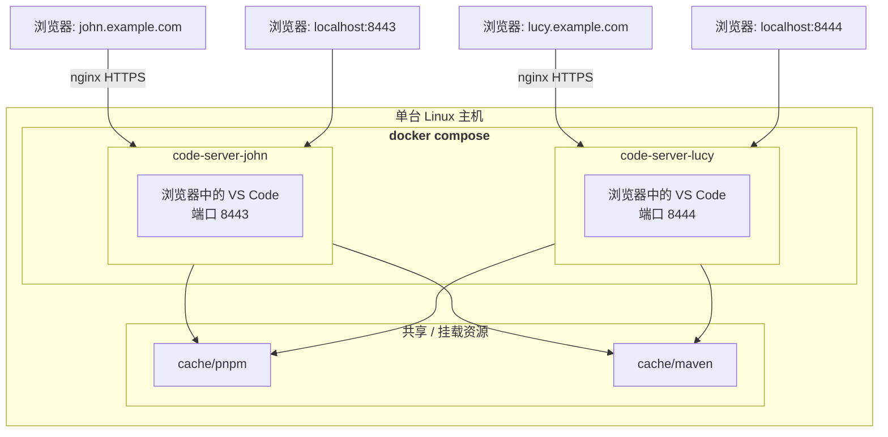

# 基于 Docker 的多用户 Code Server（网页版 VS Code）

**[English](README.md) | [中文](README.zh-CN.md)**

在一台主机上，通过 Docker Compose 为每个开发者运行一套**相互隔离的、浏览器版 VS Code（code-server）实例**。每个用户拥有独立的设置、扩展和文件，同时共享同一台机器、同一个镜像与依赖缓存。

## 为什么需要这个项目？

不同于让所有人共用同一个 VS Code 服务，本方案为每个开发者提供一个**独立的容器**。某人安装扩展、修改配置甚至把实例搞崩，都不会影响其他人；同时大家依然共享磁盘缓存，常见依赖只需下载一次。

## 特性

- **按用户隔离的实例** —— 每个用户一个容器（`code-server-john`、`code-server-lucy`……），设置、扩展与工作区相互独立。
- **预配置的开发镜像** —— 基于社区维护的 [`linuxserver/code-server`](https://github.com/linuxserver/docker-code-server) 镜像，额外内置：
  - Node.js 24 与 pnpm
  - OpenJDK 21 与 Maven
  - vim、curl 等常用工具
- **自动初始化 Git 配置** —— 首次启动时根据各用户的环境变量写入 Git 用户名/邮箱及默认行为（`pull.rebase`、`init.defaultBranch`）。
- **数据持久化** —— 每个用户的 `/config`（设置、扩展、工作区、`.gitconfig`）保存在宿主机各自的目录中。
- **可选 SSH 私钥挂载** —— 可将宿主机私钥以只读方式挂载进容器，用于 Git/SSH 操作。
- **共享依赖缓存** —— 公共的 pnpm store 与 Maven 仓库挂载进每个容器，节省磁盘与带宽。
- **预置扩展** —— 离线扩展（如 GitLens、DeepSeek V4 for Copilot）放在 `config/extensions`，并镜像到各用户目录。
- **HTTPS 反向代理示例** —— 提供现成的 nginx 配置，让每个实例通过各自的子域名访问并支持 WebSocket。

## 架构



## 目录结构

```
.
├── Dockerfile                 # 自定义镜像（code-server + Node/pnpm/Java/Maven）
├── docker-compose.yaml        # 每个用户一个 service
├── conf.d/                    # nginx HTTPS 反向代理示例（可选）
├── config/
│   ├── extensions/            # 离线扩展模板
│   ├── john/                  # John 的持久化数据（设置、扩展……）
│   └── lucy/                  # Lucy 的持久化数据
└── cache/
    ├── pnpm/                  # 共享的 pnpm store
    └── maven/                 # 共享的 Maven 仓库
```

## 环境要求

- 一台 Linux 服务器（或 macOS/Windows 上的 Docker Desktop）
- [Docker](https://docs.docker.com/engine/install/)（含 [Compose 插件](https://docs.docker.com/compose/install/)）

## 快速开始

### 1. 构建镜像

```bash
docker build -t my-code-server .
```

### 2. 配置用户

编辑 `docker-compose.yaml`，至少修改其中的密码。针对每个 service，按需调整各用户的配置：

```yaml
services:
  code-server-john:
    image: my-code-server:latest
    environment:
      - PASSWORD=change_me             # Web 登录密码
      - SUDO_PASSWORD=change_me        # 可选：sudo 密码
      - TZ=Asia/Shanghai               # 你的时区
      - PROXY_DOMAIN=john.example.com  # 可选：用于子域名访问
      - GIT_USER_NAME=John             # Git 身份（仅在首次启动时写入）
      - GIT_USER_EMAIL=John@email.com
    volumes:
      - ./config/john:/config
      - /path/to/your/id_ed25519:/config/.ssh/id_ed25519:ro   # 可选：SSH 私钥
    ports:
      - "8443:8443"   # 每个 service 的宿主机端口必须唯一
```

> compose 文件期望的镜像标签为 `my-code-server:latest`（即第 1 步构建出的镜像）。

### 3.（可选）预置扩展与 SSH 私钥

离线扩展模板保存在 `config/extensions` 中。如需某个用户离线使用这些扩展，请在**首次启动前**将其镜像到对应用户目录：

```bash
mkdir -p config/<user>/extensions
cp -r config/extensions/* config/<user>/extensions/
```

如需使用 Git/SSH，请将私钥放到宿主机上，并在 `docker-compose.yaml` 中修改对应的 `volumes` 挂载项。

### 4. 通过 nginx 提供外网及 HTTPS 访问

`conf.d/` 目录包含 nginx 示例配置，可将每个实例通过各自的（子）域名以 HTTPS 对外提供服务，并正确代理 WebSocket（VS Code 终端必需）。例如 `conf.d/john.example.com.conf` 将 `john.example.com` 代理到 `127.0.0.1:8443`。

1. 在宿主机安装 nginx，将所需片段复制到 nginx 的 `conf.d`。
2. 修改其中的 `server_name`、upstream 端口以及通配符证书路径（默认引用 `/etc/nginx/conf.d/ssl/wildcard.<domain>.crt|key`）。
3. 为对应 service 设置 `PROXY_DOMAIN=<你的域名>`，使 Web 界面从该域名加载资源。
4. 执行 `nginx -s reload`，然后访问 `https://<你的域名>`。

> code-server 的终端依赖 HTTP/1.1 升级，示例中已包含必要的 `Upgrade` / `Connection` 代理头。

### 5.（可选）无注册域名和 HTTPS 证书？配置本机自定义域名和自签名证书

上述配置引用了形如 `/etc/nginx/conf.d/ssl/wildcard.john.example.com.crt` 的通配符证书。如果没有 CA 签发的正式证书（仅用于测试或内网），可以生成自签名证书，并把它导入到**每一台访问该网站的客户端**的受信任根证书列表中——否则浏览器仍会提示"不安全"。

#### 1. 用 OpenSSL 生成通配符自签名证书

```bash
mkdir -p ssl && cd ssl

openssl req -x509 -newkey rsa:2048 -nodes -days 365 \
  -keyout wildcard.john.example.com.key \
  -out wildcard.john.example.com.crt \
  -subj "/C=CN/ST=Shanghai/L=Shanghai/O=Example Inc/CN=*.john.example.com" \
  -addext "subjectAltName=DNS:*.john.example.com,DNS:john.example.com"
```

- `subjectAltName`（SAN）中**必须**包含浏览器实际访问的主机名（`john.example.com` 及其通配符）；证书名称与地址不匹配时浏览器会拒绝连接。
- 每个用户/域名重复一次，并将生成的 `.crt`/`.key` 放到 `conf.d/` 片段所引用的路径（默认为 `/etc/nginx/conf.d/ssl/`）。
- 若是固定 IP 而非域名，把 SAN 改为 `subjectAltName=IP:<地址>`。
- `-days 365` 为证书有效期，可按需调整。需要 OpenSSL ≥ 1.1.1（macOS 自带的 LibreSSL、Windows 上 Git Bash/WSL 中的 OpenSSL 均可）。自签名证书仅用于测试/内网，**请勿**用于公网生产环境。

#### 2. 信任该证书（在每台客户端上执行）

Chrome、Edge、Safari 等浏览器使用的是操作系统的证书库，因此把证书导入系统受信任根证书列表即可（Firefox 例外，见下文）。

##### macOS

**方式 A —— 钥匙串访问（图形界面）**

1. 双击 `.crt` 文件（会自动打开"钥匙串访问"）。
2. 选择 **系统** 钥匙串（或将证书拖入"系统"钥匙串）。
3. 找到该证书并双击 → 展开 **信任** → 将 **使用此证书时** 设置为 **始终信任**。
4. 关闭窗口，输入管理员密码确认。
5. 完全退出并重新打开 Safari/Chrome（信任结果会被缓存）。

**方式 B —— 命令行**

```bash
sudo security add-trusted-cert -d -r trustRoot \
  -k /Library/Keychains/System.keychain \
  wildcard.john.example.com.crt
```

##### Windows

**方式 A —— 图形界面**

1. 右键单击 `.crt` 文件 → **安装证书**。
2. 存储位置选择 **本地计算机**（没有管理员权限可选择 **当前用户**）。
3. 选择 **将所有证书都放入下列存储** → **浏览** → **受信任的根证书颁发机构** → **确定**。
4. 点击 **完成** 并确认安全警告。
5. 重启 Chrome/Edge。

**方式 B —— MMC**

按 `Win + R`，运行 `certlm.msc` → **受信任的根证书颁发机构** → **证书** → 右键 → **所有任务** → **导入** → 选择 `.crt` 文件。

**方式 C —— PowerShell（管理员）**

```powershell
Import-Certificate -FilePath .\wildcard.john.example.com.crt `
  -CertStoreLocation Cert:\LocalMachine\Root
```

> **Firefox** 在所有平台都使用自己的证书库：打开 **设置 → 隐私与安全 → 证书 → 查看证书 → 证书颁发机构 → 导入**，选择 `.crt` 并勾选"信任由此证书颁发机构来标识网站"。

#### 3. 配置 hosts 文件，把域名指向服务器

自签名证书只对它上面写的名字有效——浏览器仍必须能把 `john.example.com` 解析到运行 nginx 的那台机器。测试阶段可以不用配置真实 DNS，直接在该客户端的 `hosts` 文件中加一行即可：

```
<nginx服务器IP>  john.example.com
```

将 `<nginx服务器IP>` 替换为：nginx 与浏览器在同一台机器时填 `127.0.0.1`，否则填 nginx 服务器的局域网或公网 IP。

> **hosts 不支持通配符**：不能写 `*.john.example.com`。你实际访问哪个主机名（如 `john.example.com`，以及 code-server 跳转到的真实子域名），就为它单独添加一行。

##### macOS

1. 打开 **终端**，用管理员权限编辑 hosts 文件：
   ```bash
   sudo nano /etc/hosts
   ```
2. 添加一行（换成你自己的 IP）并保存：
   ```
   192.168.1.10   john.example.com
   ```
   nano 中：`Ctrl + O` 保存，`Enter` 确认，再按 `Ctrl + X` 退出。
3. 刷新 DNS 缓存：
   ```bash
   sudo dscacheutil -flushcache
   sudo killall -HUP mDNSResponder
   ```
4. 验证是否解析成功：
   ```bash
   ping john.example.com
   ```

##### Windows

1. 以管理员身份打开 **记事本**（右键记事本 → **以管理员身份运行**）。
2. 点击 **文件 → 打开**，定位到 `C:\Windows\System32\drivers\etc\`，将文件类型筛选器切换为 **所有文件 (*.*)**，选择打开 **hosts**。
3. 添加一行（换成你自己的 IP）并保存：
   ```
   192.168.1.10   john.example.com
   ```
   行首以 `#` 开头的是注释。
4. 在命令提示符中刷新 DNS 缓存：
   ```
   ipconfig /flushdns
   ```
5. 验证是否解析成功：
   ```
   ping john.example.com
   ```

> 测试结束后请删除该行，以恢复正常 DNS 解析。每个客户端都必须配置 hosts（或真实 DNS），否则无论证书如何都会被拒绝连接。

### 6. 启动

```bash
docker compose up -d
```

### 7. 在浏览器中打开 VS Code

- John → <https://john.example.com>
- Lucy → <https://lucy.example.com>

> 上面的链接使用 HTTPS（默认 443 端口，已省略）。如果跳过了第 4 步的 nginx 配置而直接访问实例，请改用映射的宿主机端口：John 为 `http://<你的主机>:8443`，Lucy 为 `http://<你的主机>:8444`。

使用为该用户设置的 `PASSWORD` 登录。若配置了 `DEFAULT_WORKSPACE`（如 `/config/workspace`），启动时会自动打开该工作区。

### 8. 代理容器内启动的其他端口（子域名访问）

每个 service 都设置了 `PROXY_DOMAIN`，它会开启 code-server 的**基于子域名的端口代理**。你在某个容器内启动的任何 HTTP 服务——例如 Spring Boot 应用、Node.js 开发服务器、数据库管理界面等——都可以直接在浏览器中访问，而无需额外发布宿主机端口：

- John：容器内 8080 端口上的服务 → `https://8080.john.example.com`
- Lucy：容器内 8080 端口上的服务 → `https://8080.lucy.example.com`

规则始终是 `<端口>.<PROXY_DOMAIN>`：code-server 会把请求转发到**同一个容器内**的 `localhost:<端口>`。基于 WebSocket 的开发服务器（热更新、调试器等）同样适用。

前提条件：

1. 必须为该 service 设置 `PROXY_DOMAIN` —— `docker-compose.yaml` 中已配置（如 `john.example.com`）。
2. nginx 需要能匹配该子域名：`conf.d/` 示例已使用通配符 `server_name`（`*.john.example.com`）；若走 HTTPS，通配符证书也须覆盖 `*.john.example.com`。
3. 子域名必须能解析到你的 nginx 服务器。hosts 文件不支持通配符，因此要么配置真实的通配符 DNS，要么把每个具体的子域名（如 `8080.john.example.com`）添加到客户端 hosts 文件。
4. 应用必须真的监听容器内的那个端口（绑定 `0.0.0.0` 或 `localhost` 的对应端口）。

> 内置代理只代理 HTTP(S)/WebSocket 流量。第 4 步的 nginx 配置已正确转发 `Host` 头并支持协议升级，因此开箱即用。

> 提示：即使不为每个子域名单独配置 DNS，也可以使用基于路径的代理：`https://john.example.com/proxy/8080/`。

## 环境变量说明

| 变量 | 默认值 | 说明 |
| --- | --- | --- |
| `PUID` / `PGID` | `1000` / `1000` | `abc` 用户运行时的用户/组 ID。需与挂载目录的宿主机属主一致（见注意事项）。 |
| `TZ` | `Asia/Shanghai` | 容器时区。 |
| `PASSWORD` | – | Web 界面登录密码，留空则无需密码。 |
| `SUDO_PASSWORD` | – | 可选；用于在集成终端中执行 `sudo`。 |
| `DEFAULT_WORKSPACE` | – | 默认打开的工作区目录（如 `/config/workspace`）。 |
| `PROXY_DOMAIN` | – | 通过反向代理以子域名访问时使用的域名。 |
| `GIT_USER_NAME` / `GIT_USER_EMAIL` | – | 首次启动时写入的 Git 身份（已配置则跳过）。 |

## 添加新用户

要为第三位开发者添加实例：

1. 创建配置目录：`mkdir -p config/<name>/extensions`，需要的话预置扩展。
2. 在 `docker-compose.yaml` 中复制一份 service，修改名称、宿主机端口、密码、Git 身份与私钥路径。注意：**宿主机端口不能重复**。
3.（可选）添加对应的 `conf.d/<name>.example.com.conf` 及独立私钥。
4. 执行 `docker compose up -d`。

## 注意事项

- **文件权限**：所有用户共用同一个镜像用户（`abc`，uid/gid 由 `PUID`/`PGID` 决定）和共享缓存，请在各 service 中保持 `PUID=1000`/`PGID=1000` 一致，并确保宿主机目录属主为该 uid。
- **端口冲突**：每个 service 都将容器 8443 端口映射到**不同的**宿主机端口，新增用户时请注意检查。
- **安全**：对外提供服务前务必修改所有密码；如需暴露到公网，建议在其前面加一层带 HTTPS 的 nginx。
- **首次运行挂载缓存**：共享的 pnpm/Maven 缓存目录在容器创建前即被挂载，若挂载报错，请先在宿主机创建目录（`mkdir -p cache/pnpm cache/maven`）。
- **仅首次写入**：Git 身份、默认行为及 bash 提示符仅在尚未配置时写入，因此不会覆盖用户之后的自行修改。

## 许可证

[MIT](LICENSE)
